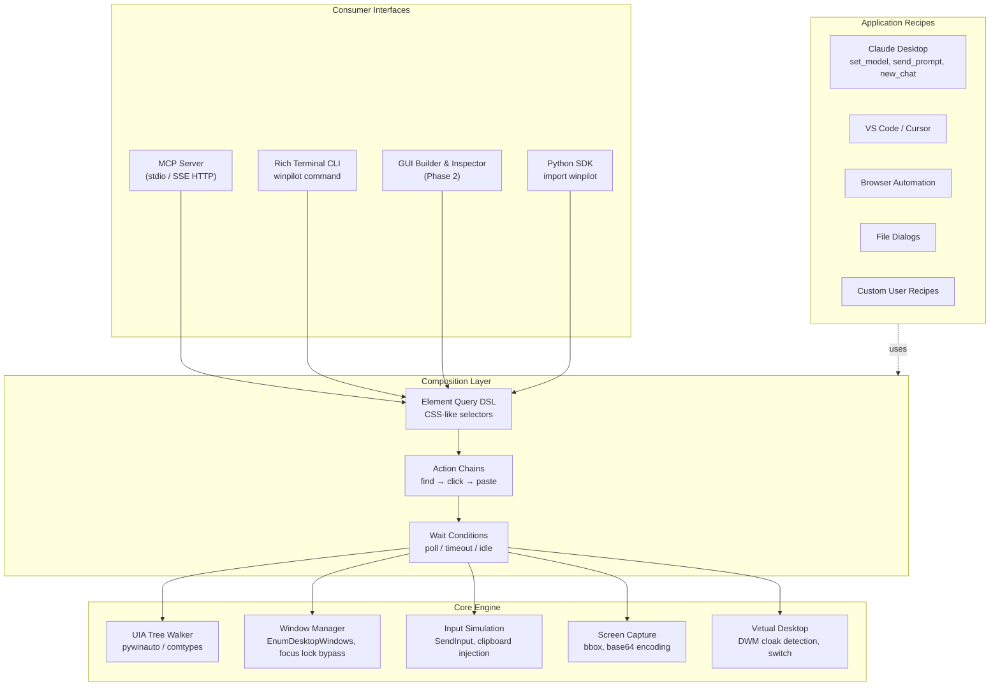

# WinPilot — Action Plan & Architectural Roadmap

A general-purpose Windows desktop automation toolkit designed to be consumed equally by **AI/coding agents** (via Model Context Protocol, Python SDK) and **manual operators** (via CLI and GUI).

Uses the Microsoft Windows UI Automation (UIA) API for reliable, semantic, DPI/resolution-independent element interaction rather than blind coordinate-based mouse clicks.

---

## 1. Problem Statement & Gap Analysis

Existing desktop automation solutions in the AI agent ecosystem exhibit key limitations:

| Tool | Limitation | WinPilot Advantage |
|---|---|---|
| `sbroenne/mcp-windows` | Raw UIA primitives only; no action chaining, recipes, or visual verification | Layered architecture with fluent ActionChains and application recipes |
| `CursorTouch/Windows-MCP` | Coordinate-based clicks; fragile across differing screen resolutions and DPI | Semantic UIA element resolution (`Button[Name="..."]`) |
| `pywinauto` | Powerful library, but lacks MCP server, CLI, and agent-first tool interfaces | Native FastMCP server, Rich CLI, and agent-first tool design |
| `uiautomation` | Low-level COM wrapper without composition DSL or retry synchronization | High-level CSS-like query DSL (`Query.find_one`) with dynamic polling |

**WinPilot's Value Proposition**: A unified 4-layer architecture separating **Core Primitives** (HWND, UIA, Input, Screen) from **Composition** (ActionChains, Query DSL, Wait Conditions), exposed through **Multiple Interfaces** (MCP, CLI, GUI, Python SDK) with **Application Recipes** on top.

---

## 2. System Architecture

---

## 3. Phased Implementation Roadmap

### Phase 1: Core Engine, MCP, CLI & Claude Recipe (COMPLETED)
- [x] **Project Scaffolding**: `pyproject.toml`, virtual environment (`.venv`), package structure (`winpilot`).
- [x] **Core Engine (`winpilot/core/`)**:
  - `window.py`: Win32 window manager using `EnumDesktopWindows` on `WinSta0\Default` to avoid `ERROR_BUSY (170)`. Foreground lock bypass (`AttachThreadInput` + `AllowSetForegroundWindow`) and DWM cloak detection (`DWMWA_CLOAKED = 14`).
  - `uia.py`: UI Automation tree walker (`UIATree`) and element wrapper (`UIElement`) with auto-pattern execution (`InvokePattern`, `TogglePattern`, `SelectionItemPattern`) and hardware fallback.
  - `input.py`: Hardware keystroke synthesis, `SendInput` Unicode typing, and safe Unicode clipboard injection (`paste_text`).
  - `screen.py`: Window and full desktop screenshot capture with file saving and base64 serialization.
- [x] **Composition Layer (`winpilot/compose/`)**:
  - `query.py`: CSS-like query DSL supporting control types, attribute selectors (`[Name*="..."]`), IDs (`#id`), and classes (`.class`).
  - `wait.py`: Synchronization primitives (`wait_for_window`, `wait_for_element`, `wait_until_gone`).
  - `actions.py`: Fluent `ActionChain` builder for clean scripting.
- [x] **Application Recipes (`winpilot/recipes/`)**:
  - `claude_desktop.py`: Automated model selector popover navigation, prompt injection, new chat (`Ctrl+N`), and rate-limit detection.
- [x] **Interfaces**:
  - `mcp_server.py`: FastMCP server exposing 8 tools (`list_desktop_windows`, `focus_window`, `get_ui_tree`, `click_element`, `paste_text`, `send_keys`, `capture_screenshot`, `run_recipe`).
  - `cli.py`: Rich terminal interface with `winpilot list`, `winpilot inspect`, `winpilot focus`, `winpilot click`, `winpilot paste`, `winpilot screenshot`, `winpilot recipe claude-*`, and `winpilot serve`.
- [x] **Testing & Git Workflow**:
  - Pytest automated test suite in `tests/`.
  - Curated `sync.ps1` with pre-commit pytest verification, secret scanning, and component-aware conventional commit generation.
  - `AGENTS.md` repository conventions.

---

### Phase 2: Expansion & Visual Tooling (IN PROGRESS)
- [x] **Silent Screen & Window Capture (Win+PrtScn Style)**:
  - Native Win32 GDI `BitBlt` with `CAPTUREBLT` and DPI-aware virtual desktop metrics. Zero OS popups, toasts, or chimes.
  - Automatic detection of standard Windows `Screenshots` folder (OneDrive/registry redirected).
  - Target window capture with `PrintWindow` fallback for occluded/offscreen windows.
  - Verbose terminal telemetry panel with target name, HWND, PID, process, bounds, resolution, and engine.
- [x] **Desktop & Window Screen Recorder (`ScreenRecorder`)**:
  - Multi-threaded background frame recording engine tracking full desktop or target window HWND.
  - Dual encoders: H.264 `.mp4` video (via system `ffmpeg`) and pure Pillow animated `.gif` fallback.
  - Interactive CLI `winpilot record` command with live terminal dashboard showing real-time duration, FPS, and frame count.
- [ ] **GUI Automation Builder & Live Inspector (`winpilot/gui/`)**:
  - Tkinter-based desktop GUI (zero extra system dependencies on Windows).
  - Live element picker: hover over any application window to highlight its UIA bounding box and display its selector.
  - Visual Action Chain recorder: record clicks, pastes, and keystrokes, then export as a Python script or WinPilot recipe.
- [ ] **Remote Transport (SSE / Streamable HTTP)**:
  - Add Streamable HTTP / Server-Sent Events (SSE) support to `winpilot serve` for remote AI agent orchestration across local networks or Cloudflare tunnels.
- [ ] **Extended Recipes**:
  - `vs_code.py`: Command palette triggering, terminal creation, file opening.
  - `browser.py`: Chrome/Edge/Firefox address bar navigation, tab switching, download dialog handling.
  - `file_dialog.py`: Universal Open/Save dialog path typing and confirmation.
- [ ] **OCR Fallback**:
  - Windows OCR (via `WinRT` / `Windows.Media.Ocr`) or Tesseract fallback for apps with sparse accessibility trees (legacy Win32, custom Canvas games, Direct3D).

---

### Phase 3: Ecosystem & Fleet Integration (PLANNED)
- [ ] **Claude-Desktop Fleet Integration**:
  - Replace inlined Win32 code in `Claude-Desktop/client/adapters/claude_desktop_cdp.py` with `from winpilot.recipes.claude_desktop import ClaudeDesktopRecipe`.
  - Add 1-click model switching in `Claude-Desktop/tools/fleet_gui.py` utilizing WinPilot.
- [ ] **PyPI Packaging**:
  - Publish `winpilot` wheel to PyPI (`pip install winpilot`).
- [ ] **Community Recipe System**:
  - User-contributed declarative recipe configs (`~/.winpilot/recipes/*.json` or YAML).

---

## 4. Claude-Desktop Fleet Integration Matrix

| Fleet Need | WinPilot Component | Implementation |
|---|---|---|
| Model Switching | `ClaudeDesktopRecipe.set_model()` | UIA tree walk → click model popover → select MenuItem |
| Prompt Dispatch | `ClaudeDesktopRecipe.send_prompt()` | Bypasses focus lock → clicks input box → clipboard paste → Enter |
| Multi-Window Tiling | `Window.move()` / `SetWindowPos` | Grid math applied across enumerated HWNDs |
| Cooldown Detection | `ClaudeDesktopRecipe.detect_cooldown()` | Scans Text elements for 5-hour rate-limit text |
| Virtual Desktop 2 Isolation | `Window.is_cloaked` + Uncloak | Detects `DWMWA_CLOAKED` and switches desktop |
| Agent Self-Automation | `winpilot-mcp` | Hosted MCP server added to `team-mcp.json` |

---

## 5. Verification & Test Guidelines

- **Unit Tests**: Must run in headless CI or offline environments without requiring live desktop apps (`pytest tests/`).
- **Live Integration Tests**:
  - `winpilot list`: Verify window handles, process names, and cloaking states.
  - `winpilot inspect "<App>"`: Verify non-empty UIA node hierarchies.
  - `winpilot recipe claude-model`: Verify successful dropdown interaction on a running Claude window.
- **Pre-Commit Gate**: Always run `.\sync.ps1` before pushing to ensure all tests pass and no credentials leak.
